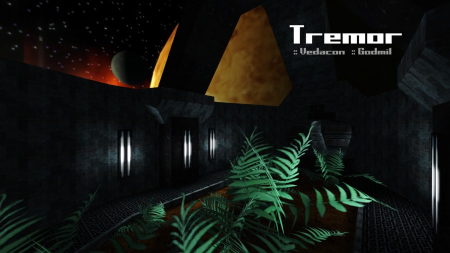

Tremor
------

This is a map ported from the [Tremulous](http://tremulous.net/) game to the [Unvanquished](https://www.unvanquished.net/) game. It features the abandoned, floating husk of a former space station now infested with the presence of the alien threat.

Ported from Tremulous gpp package from [http://ingar.satgnu.net/files/tremulous/base/](http://ingar.satgnu.net/files/tremulous/base/).

This port is an Interstellar Oasis initiative: [https://github.com/InterstellarOasis/InterstellarOasis](https://github.com/InterstellarOasis/InterstellarOasis).

Levelshot
---------



How-to
------

* Get the source

```
git clone https://github.com/InterstellarOasis/map-tremor_src.dpkdir.git
cd map-tremor_src.dpkdir/
```

* Build

You need the [Urcheon](https://github.com/illwieckz/Urcheon) tool.  
You will find the dpkdir in `build/test`.

```
urcheon build
```

* Package

You will find the dpk in `build/pkg`.

```
urcheon package
```

Run the map:

```
daemon -pakpath build/pkg +devmap tremor
```

Credits
-------

Unvanquished port:

* Thomas “illwieckz” Debesse <dev@illwieckz.net> (http://gg.illwieckz.net)

Mapping:

* Mike “Vedacon” McInnerney
* Gordon “Godmil” Miller <godmil@gmail.com> (http://godmil.com/)

Textures & Shaders:

* Mike “Vedacon” McInnerney
* Randy “ydnar” Redding <ydnar@shaderlab.com> (http://www.shaderlab.com)
* Tim “Timbo” Angus <tim@ngus.net>
* Yves “evil lair” Allaire (http://evillair.net)
* Louie “KnightBK“ Doulias

Models:

* Jan “Stannum” Van der Weg (http://janvanderweg.com/)
* Mike “Vedacon” MciInnerney

Special thanks:

* Nicolas “Jex“ Jansens <jex@orodu.net>
* Stijn “Ingar“ Buys <ingar@osirion.org>
* Paul “MoP” Greveson (http://www.predictable-paul.com/)
* Robin “OverFlow” Marshall (http://bobbin.vilkacis.net)
* Dan “kharnov” Floda
* Tristan “Jhrx“ Blease
* Crimity
* Kat
* Lava Croft
* Molog
* Myth
* Roughrider

Legal
-----

Changes by Thomas Debesse fall under the Internet Systems Consortium License:  
http://directory.fsf.org/wiki/License:ISC

Assets by Tremulous contributors fall under the Creative Commons Attribution-ShareAlike 2.5 Generic License:  
http://creativecommons.org/licenses/by-sa/2.5/

Textures by Yves Allaire fall under the Creative Commons Attribution-ShareAlike 4.0 International License:  
http://creativecommons.org/licenses/by-sa/4.0/

Textures from shaderlab are subject to the terms of this notice:  
Usage and redistribution policy: Textures may be freely downloaded, modified, and used in free maps, mods or total conversions provided this copyright notice is left intact and a link to Shaderlab is provided in the credits or read-me file. Other non-commercial applications are considered on a case-by-case basis via e-mail. All other usage requires written permission. Bulk redistribution or archival of the textures in any medium, digital or otherwise (except mapping packages for mods) is prohibited.

History
-------

* 2015-08-16:	Tremor 1.2 (Unvanquished community map)
* 2009-12-04:	Tremulous 1.2 Beta (Gameplay preview)
* 2006-03-31:	Tremulous 1.1.0 (Standalone)
